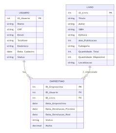

# TRABALHO PRÁTICO - IMPLEMENTAÇÃO DE BIBLIOTECA DE PERSISTÊNCIA EM LINGUAGEM C E SISTEMA COM 3 ENTIDADES RELACIONADAS

Este trabalho prático engloba dois tópicos distintos:

1) a implementação de uma biblioteca de persistência de dados em arquivo binário em linguagem C, e

2) a implementação de um sistema com 3 entidades relacionadas, como por exemplo, Usuário, Livro e Empréstimo. O sistema deve usar a biblioteca de persistência para gravar e recuperar as informações gravadas em disco.

## 1) Biblioteca de Persistência

Este tópico do trabalho refere-se à implementação da biblioteca de persistência de dados, cujo objetivo é centralizar as operações mais comuns de gravação de dados em arquivos, tais como o CRUD (Create, Retrieve, Update, Delete).

A biblioteca já foi implementada quase na totalidade durante as aulas, basta implementar as operações que faltam.

Cada arquivo será representado por um descritor com a seguinte estrutura:

```c
struct dFile {
    FILE* arquivo;          // referência ao arquivo em disco
    int tamanhoRegistro;    // quantidade de bytes do tipo de dado (struct) a ser gravado/lido
};
```

Os tipos de dados e as operações da biblioteca de persistência estão descritos no quadro a seguir.

## 2) Sistema com 3 entidades relacionadas

O segundo tópico deste trabalho trata da implementação de um sistema contendo, no mínimo, 3 entidades relacionadas, conforme o exemplo de diagrama ilustrado na figura a seguir.



No caso do registro de novo empréstimo, é necessário fazer algumas consistências, como por exemplo:

- Validar se o ID do usuário informado está cadastrado, assim como o ID do livro.
- Validar se tem exemplar do livro disponível para empréstimo (verificando o atributo Quantidade_Disponível do arquivo de livros).
- Validar a data de devolução prevista para que não seja inferior a data do empréstimo.